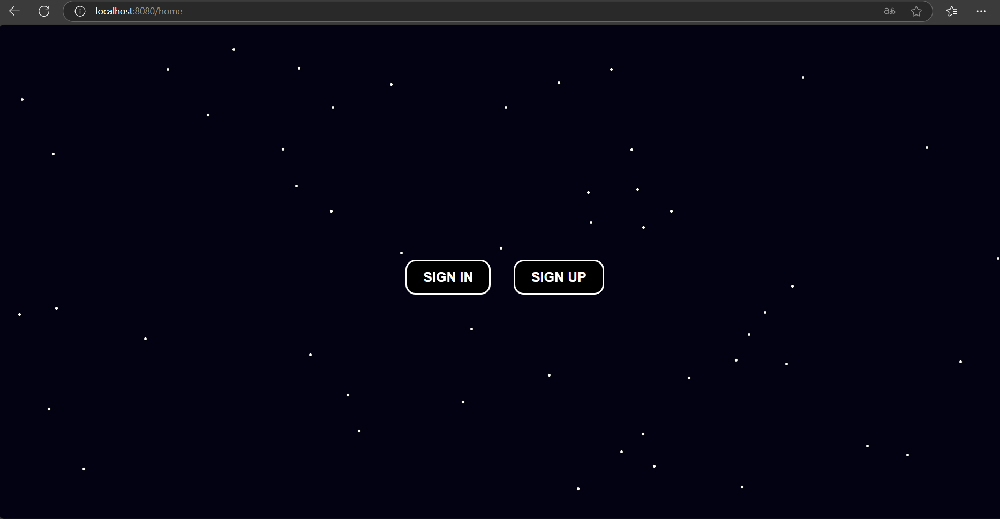
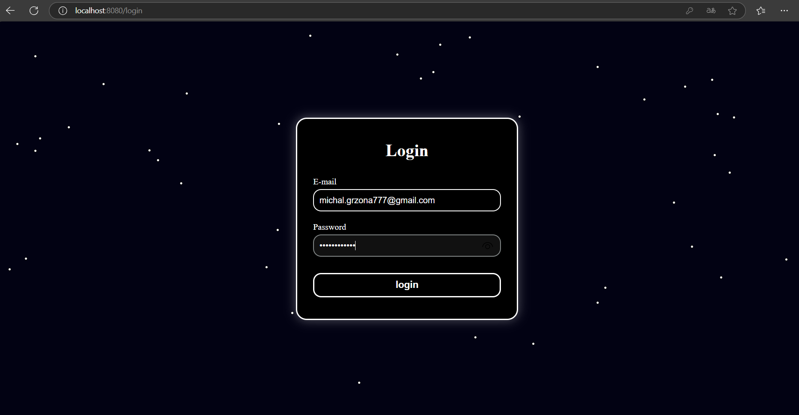
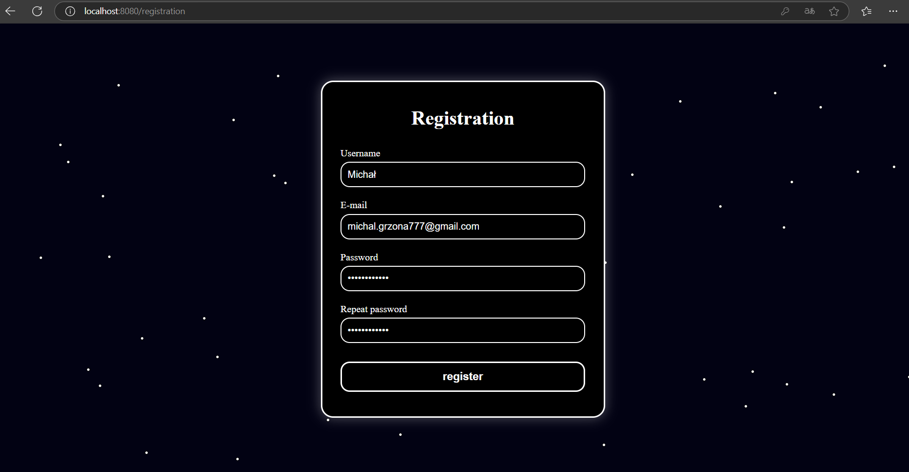
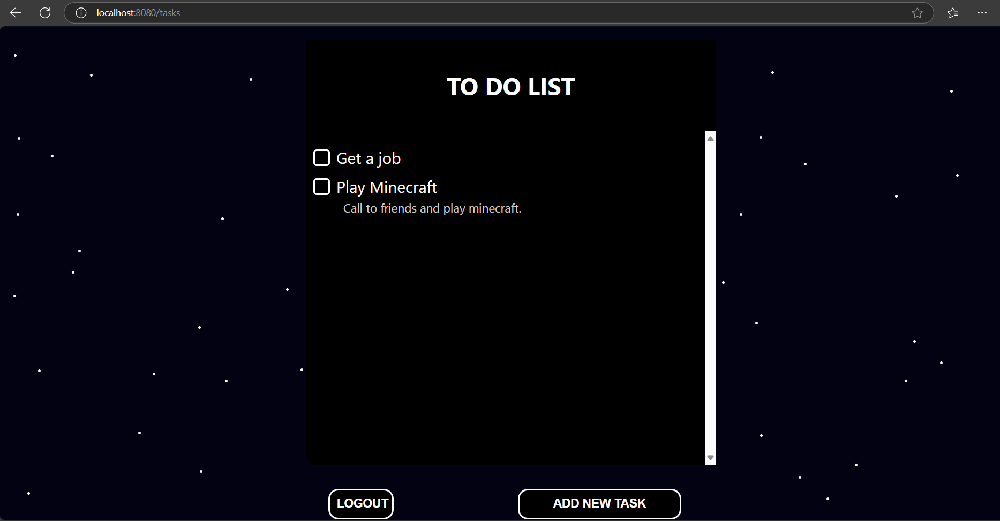
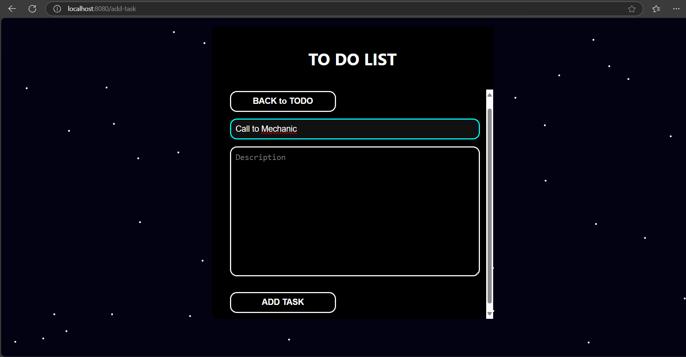

# 📝 ToDo App — Spring Boot + MySQL + Spring Security

A simple and secure ToDo web application built with **Spring Boot**, **MySQL**, and **Spring Security**, supporting *
*user authentication and role-based task management**. Frontend is powered by **HTML**, **CSS**, and **JavaScript**.

---

## ✨ Features

- 🔐 User registration & login
- 🧑‍🤝‍🧑 User-specific task management
- ➕ Adding tasks and marking them as completed
- 🗝️ Authentication & authorization with Spring Security
- 💾 Persistent storage in MySQL
- 🌐 Minimalistic frontend using HTML, CSS, JS

---

## 📁 Project Structure

src/main/  
├── java/myprojects.todolist/  
&nbsp;|&nbsp;&nbsp;&nbsp;&nbsp;&nbsp;&nbsp;├── config/ # Security config  
&nbsp;|&nbsp;&nbsp;&nbsp;&nbsp;&nbsp;&nbsp;├── contoller/ # Controller and RestController  
&nbsp;|&nbsp;&nbsp;&nbsp;&nbsp;&nbsp;&nbsp;├── dto/ # DTO entities (UserDto, TaskDto)  
&nbsp;|&nbsp;&nbsp;&nbsp;&nbsp;&nbsp;&nbsp;├── model/ # JPA entities (User, Task)  
&nbsp;|&nbsp;&nbsp;&nbsp;&nbsp;&nbsp;&nbsp;├── repository/ # Spring Data JPA repositories  
&nbsp;|&nbsp;&nbsp;&nbsp;&nbsp;&nbsp;&nbsp;├── service/ # Business logic  
&nbsp;|&nbsp;&nbsp;&nbsp;&nbsp;&nbsp;&nbsp;└── TodoListApplication # (main method)  
└── resources/  
&nbsp;&nbsp;&nbsp;&nbsp;&nbsp;&nbsp;&nbsp;&nbsp;&nbsp;├── static/ # CSS, JS  
&nbsp;&nbsp;&nbsp;&nbsp;&nbsp;&nbsp;&nbsp;&nbsp;&nbsp;├── templates/ # HTML  
&nbsp;&nbsp;&nbsp;&nbsp;&nbsp;&nbsp;&nbsp;&nbsp;&nbsp;├── application.properties    
&nbsp;&nbsp;&nbsp;&nbsp;&nbsp;&nbsp;&nbsp;&nbsp;&nbsp;├── application-h2.properties    
&nbsp;&nbsp;&nbsp;&nbsp;&nbsp;&nbsp;&nbsp;&nbsp;&nbsp;└── application-mysql.properties


---

## ⚙️ Technologies Used

| Backend         | Frontend | Database | Security        |
|-----------------|----------|----------|-----------------|
| Spring Boot     | HTML     | MySQL    | Spring Security |
| Spring Data JPA | CSS, JS  | H2       | BCrypt          |

--- 

## 🚀 Getting Started

### ✅ Prerequisites

- Java 17+
- Maven
- MySQL

### 🔧 Setup and Run

1. **Clone the repository**
   ```bash
   git clone https://github.com/SadCat15/TODO-list.git
   cd TODO-list 

#### 🔹 Option 1: Run instantly with H2 (in-memory database)

1. No configuration required.
2. Run the app using the `h2` profile:
   ```bash
   ./mvnw spring-boot:run -Dspring-boot.run.profiles=h2
3. The database will be created automatically in memory.

#### Option 2: Run with MySQL (production-ready)

1. Create database
   ```bash
   CREATE DATABASE todo_app;
2. Create config file:
   **src/main/resources/application-mysql.properties**
3. Paste the folowing and configure your DB credentials:
   ```bash
   spring.jpa.hibernate.ddl-auto=update
   logging.level.org.hibernate.Type=TRACE
   spring.jpa.properties.hibernate.dialect=org.hibernate.dialect.MySQL8Dialect
   spring.datasource.url=jdbc:mysql://localhost:3306/todo_app
   spring.datasource.username=YOUR_DB_USERNAME
   spring.datasource.password=YOUR_DB_PASSWORD
4. Run the app with MySQL profile:
   ```bash
   ./mvnw spring-boot:run -Dspring-boot.run.profiles=mysql

## 🌐 Access the app
[http://localhost:8080/home](http://localhost:8080/home)

#### Home page

#### Login page

#### Registration page

#### Page with tasks

#### Adding new task


### 👨‍💻 Author
**Michał Grzona**  
📖 Student of Computer Science   
📫 Contact: Michal.Grzona777@gmail.com